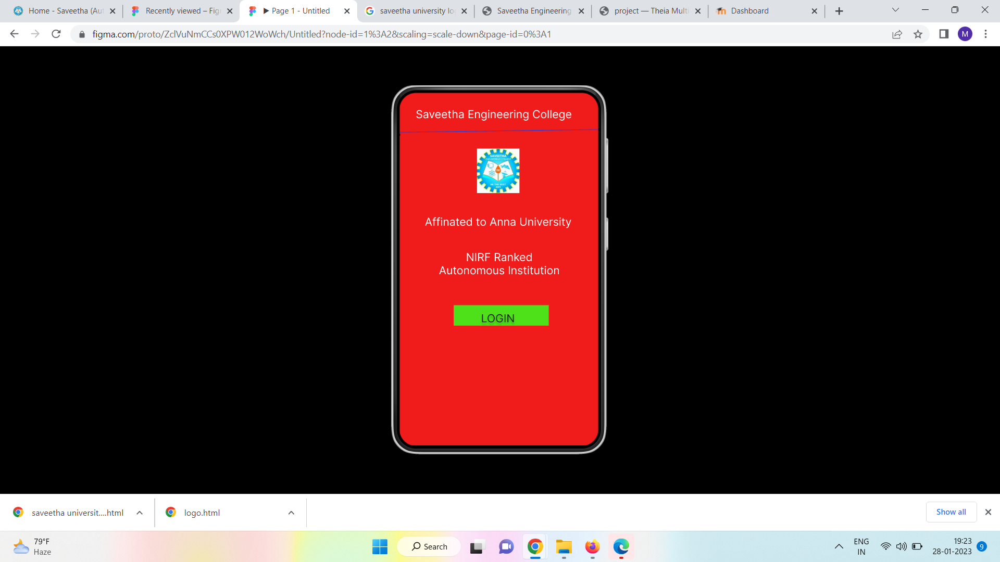
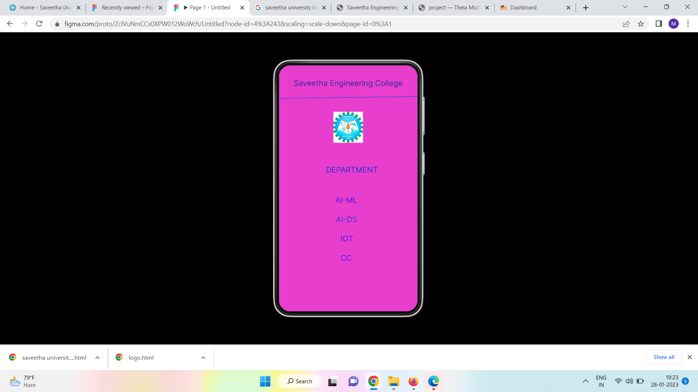

# Event Registration Web Application

## AIM:
To design, develop and deploy a web application for event registration.

## DESIGN STEPS:

### Step 1:
Create a new frame.

### Step 2:
Select any one preset size of your choice.

### Step 3:
Select the shapes you need.

### Step 4:
Import images as needed.

### Step 5:
Create pages based on your need and link them.

### Step 6:

Validate the HTML and CSS code.

### Step 6:

Publish the website in the given URL.

## DESIGN TOOL:
Figma

## code:
```

/* Home Page */
position: relative;
width: 360px;
height: 639px;

background: #F01C1C;

/* Line 3 */
position: absolute;
width: 367.03px;
height: 0px;
left: 0px;
top: 72px;

border: 1px solid #1042F1;
transform: rotate(-0.78deg);

/* LOGIN */
position: absolute;
width: 126px;
height: 14px;
left: 115px;
top: 397px;

font-family: 'Inter';
font-style: normal;
font-weight: 400;
font-size: 20px;
line-height: 24px;
text-align: center;

color: #1E1C1C;

text-shadow: 0px 4px 4px rgba(0, 0, 0, 0.25);

/* Rectangle 1 */
position: absolute;
width: 172px;
height: 37px;
left: 98px;
top: 385px;

background: #4EE11A;

/* NIRF Ranked Autonomous Institution */
position: absolute;
width: 285px;
height: 39px;
left: 38px;
top: 286px;

font-family: 'Inter';
font-style: normal;
font-weight: 400;
font-size: 20px;
line-height: 24px;
text-align: center;

color: #FFFFFF;

/* Saveetha_Engineering_College 1 */
position: absolute;
width: 77px;
height: 81px;
left: 140px;
top: 101px;

background: url(Saveetha_Engineering_College)

/* Affinated to Anna University */
position: absolute;
width: 323px;
height: 28px;
left: 17px;
top: 222px;

font-family: 'Inter';
font-style: normal;
font-weight: 400;
font-size: 20px;
line-height: 24px;
text-align: center;

color: #FFFFFF;

/* Saveetha Engineering College */
position: absolute;
width: 323px;
height: 28px;
left: 9px;
top: 27px;

font-family: 'Inter';
font-style: normal;
font-weight: 400;
font-size: 20px;
line-height: 24px;
text-align: center;

color: #FFFFFF;

/* Login Page */
position: relative;
width: 360px;
height: 640px;

background: #FFEF64;

/* Username */
position: absolute;
width: 162px;
height: 31px;
left: 32px;
top: 226px;

font-family: 'Inter';
font-style: normal;
font-weight: 400;
font-size: 20px;
line-height: 24px;

color: #E61818;

/* Rectangle 4 */
position: absolute;
width: 220px;
height: 34px;
left: 32px;
top: 385px;

background: #4CD8D8;

/* Rectangle 3 */
position: absolute;
width: 220px;
height: 34px;
left: 32px;
top: 278px;

background: #4CD8D8;

/* SUBMIT */
position: absolute;
width: 126px;
height: 9px;
left: 126px;
top: 479px;

font-family: 'Inter';
font-style: normal;
font-weight: 400;
font-size: 16px;
line-height: 19px;
text-align: center;

color: #151313;

/* Rectangle 2 */
position: absolute;
width: 172px;
height: 37px;
left: 98px;
top: 471px;

background: #4EE11A;

/* Saveetha_Engineering_College 2 */
position: absolute;
width: 77px;
height: 81px;
left: 145px;
top: 100px;

background: url(Saveetha_Engineering_College)

/* Password */
position: absolute;
width: 147px;
height: 18px;
left: 37px;
top: 350px;

font-family: 'Inter';
font-style: normal;
font-weight: 400;
font-size: 20px;
line-height: 24px;

color: #FF1C1C;

/* Line 4 */
position: absolute;
width: 367.03px;
height: 0px;
left: -7px;
top: 68px;

border: 1px solid #1042F1;
transform: rotate(-0.78deg);

/* Saveetha Engineering College */
position: absolute;
width: 323px;
height: 28px;
left: 18px;
top: 22px;

font-family: 'Inter';
font-style: normal;
font-weight: 400;
font-size: 20px;
line-height: 24px;
text-align: center;

color: #E60F1C;

/* SEC Page */
position: relative;
width: 360px;
height: 640px;

background: #E83ECD;


/* Saveetha Engineering College */
position: absolute;
width: 323px;
height: 28px;
left: 18px;
top: 35px;

font-family: 'Inter';
font-style: normal;
font-weight: 400;
font-size: 20px;
line-height: 24px;
text-align: center;

color: #2C29A2;

/* Line 5 */
position: absolute;
width: 367.03px;
height: 0px;
left: -3px;
top: 87px;

border: 1px solid #1042F1;
transform: rotate(-0.78deg);

/* Saveetha_Engineering_College 3 */
position: absolute;
width: 77px;
height: 81px;
left: 141px;
top: 121px;

background: url(Saveetha_Engineering_College)

/* DEPARTMENT */
position: absolute;
width: 162px;
height: 31px;
left: 122px;
top: 260px;

font-family: 'Inter';
font-style: normal;
font-weight: 400;
font-size: 20px;
line-height: 24px;

color: #282FCE;

/* AI-ML */
position: absolute;
width: 162px;
height: 31px;
left: 146px;
top: 339px;

font-family: 'Inter';
font-style: normal;
font-weight: 400;
font-size: 20px;
line-height: 24px;

color: #4D18E6;

/* AI-DS */
position: absolute;
width: 162px;
height: 31px;
left: 148px;
top: 389px;

font-family: 'Inter';
font-style: normal;
font-weight: 400;
font-size: 20px;
line-height: 24px;

color: #572BD5;

/* IOT */
position: absolute;
width: 162px;
height: 31px;
left: 160px;
top: 439px;

font-family: 'Inter';
font-style: normal;
font-weight: 400;
font-size: 20px;
line-height: 24px;

color: #4D18E6;

/* CC */
position: absolute;
width: 162px;
height: 31px;
left: 160px;
top: 489px;

font-family: 'Inter';
font-style: normal;
font-weight: 400;
font-size: 20px;
line-height: 24px;

color: #4D18E6;

```

## OUTPUT:




## RESULT:
The program to design, develop and deploy a web application for event registration is completed successfully.